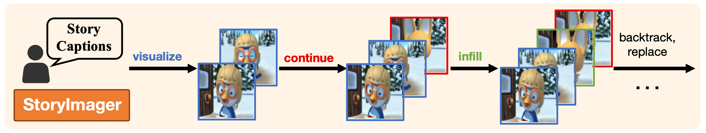

# StoryImager: A Unified and Efficient Framework for Coherent Story Visualization and Completion


<p align="center">
    
</p>

# A high-quality, unified, and efficient framework for story visualization and completion


Official Pytorch implementation for our paper [**StoryImager: A Unified and Efficient Framework for Coherent Story Visualization and Completion**](https://arxiv.org/abs/2404.05979) by [Ming Tao](https://scholar.google.com/citations?user=5GlOlNUAAAAJ), [Bing-Kun Bao](https://scholar.google.com/citations?user=lDppvmoAAAAJ&hl=en), [Hao Tang](https://scholar.google.com/citations?user=9zJkeEMAAAAJ&hl=en), [Yangwei Wang](https://scholar.google.com/citations?user=o_DllmIAAAAJ&hl=en), [Changsheng Xu](https://scholar.google.com/citations?user=hI9NRDkAAAAJ). 

## Requirements
- python 3.9
- Pytorch 1.13

## Preparation
### Datasets
1. Download the preprocessed data for [PororoSV](https://drive.google.com/file/d/11Io1_BufAayJ1BpdxxV2uJUvCcirbrNc/view) [FlintstonesSV](https://drive.google.com/file/d/1kG4esNwabJQPWqadSDaugrlF4dRaV33_/view) and extract them to `data/`

## Training

## Evaluation

### Download Pretrained Model

## Sampling
  
### Synthesize images from your story descriptions
  - the sample.ipynb can be used to sample

---
### Citing StoryImager

If you find StoryImager useful in your research, please consider citing our paper:
```

@article{tao2024storyimager,
  title={StoryImager: A Unified and Efficient Framework for Coherent Story Visualization and Completion},
  author={Tao, Ming and Bao, Bing-Kun and Tang, Hao and Wang, Yaowei and Xu, Changsheng},
  journal={arXiv preprint arXiv:2404.05979},
  year={2024}
}

